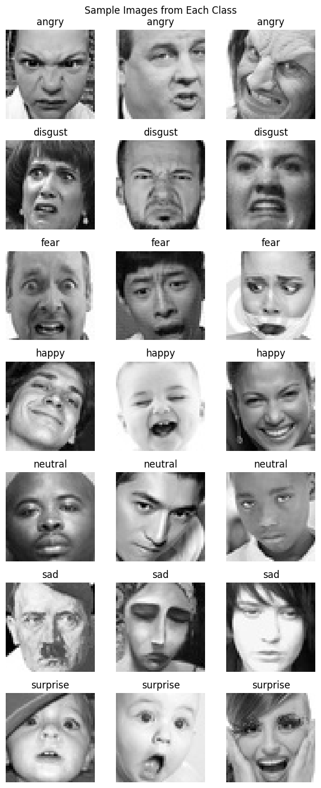
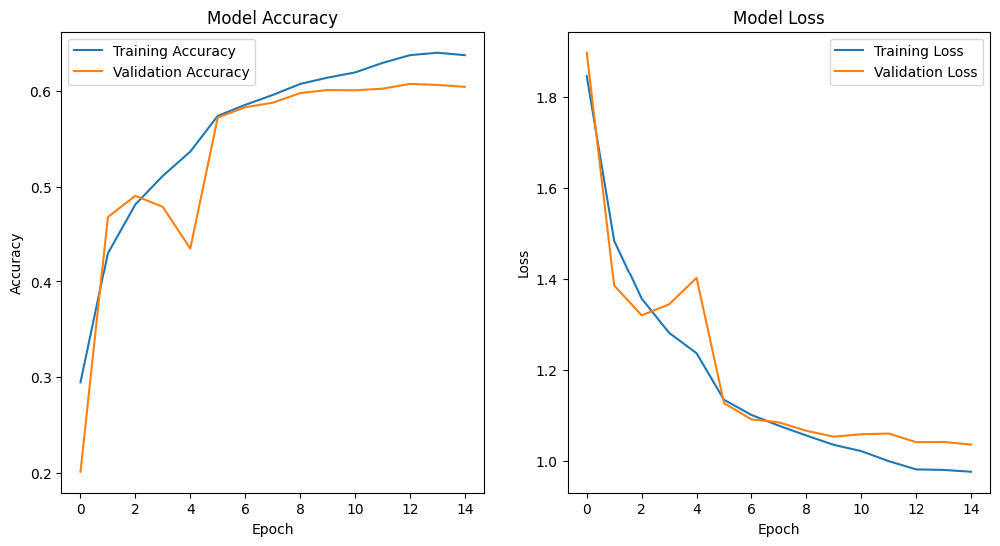
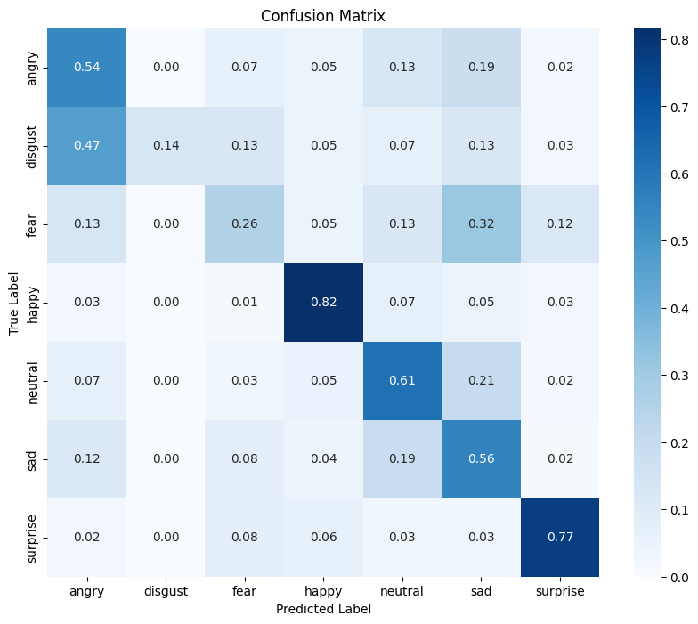
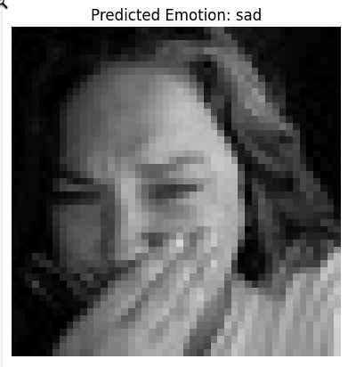

# **Facial Emotion Detection With Machine Learning**
<center></center>

# **Project Overview**
The project aims to develop a machine learning model capable of recognizing and classifying human emotions based on facial expressions. This endeavor addresses the challenge of interpreting complex emotional states, which is a key aspect of enhancing human-computer interaction. By accurately identifying emotions, such technology can be applied in various domains including mental health assessment, customer service, and interactive gaming, improving the way machines understand and interact with humans.


### Data Source
The dataset utilized in this project is the [FER2013 dataset](https://www.kaggle.com/datasets/msambare/fer2013) dataset, available on Kaggle. This dataset, initially used in the ICML 2013 Challenges in Representation Learning, comprises grayscale images of human faces, each labeled with one of seven emotions: anger, disgust, fear, happiness, neutral, sadness, and surprise. The images are 48x48 pixels in size and are categorized into training and test sets.

Key aspects of the dataset include:

* Number of Images: It consists of 35,887 images in total, providing a substantial volume for training and validating the machine learning model.
* Emotion Labels: Each image is labeled with one of the seven emotions, making it a multi-class classification problem.
* Grayscale Images: The use of grayscale images puts the focus on facial features and expressions rather than color-based attributes.
* Public Domain: The dataset is publicly available for research and development purposes, making it an accessible choice for emotion recognition projects.
* This dataset serves as a foundation for training deep learning models, particularly Convolutional Neural Networks (CNNs), to learn and predict human emotions from facial expressions effectively.

The dataset is available freely available from several sources but is most easily sourced from the Kaggle python API. Note, Please set your Kaggle credentials in the `kaggle.json` file

### Methodology

* Data Preprocessing
  * Image Resizing: Images are resized to a uniform dimension (48x48 pixels) to ensure consistency in input size for the model.
  * Grayscale Conversion: Color images are converted to grayscale, focusing the model on learning from facial features rather than color.
  * Normalization: Pixel values are normalized to the range [0, 1], improving model training efficiency and stability.
  * Data Augmentation: Techniques like horizontal flipping are applied to augment the training dataset, enhancing the model's ability to generalize.
* Model Optimization
  * Layer Experimentation: Different configurations of convolutional, pooling, and dense layers are tested to find the optimal architecture.
  * Hyperparameter Tuning: Tuning key parameters such as learning rate, batch size, and the number of epochs to achieve better performance.
  * Regularization Techniques: Implementing dropout and batch normalization to prevent overfitting and ensure a more robust model.
* Model Building
  * CNN Architecture: Employing Convolutional Neural Networks (CNNs) due to their effectiveness in image recognition tasks.
  * Activation Functions: Utilizing ReLU for hidden layers for non-linearity and softmax for the output layer for multi-class classification.
  * Sequential Layer Stacking: Constructing the model in a sequential manner, layer by layer, from input to output.
* Evaluation (Accuracy, Loss)
  * Training and Validation Curves: Plotting accuracy and loss for both training and validation sets to monitor the model's learning progress.
  * Confusion Matrix: Analyzing the model's performance across different classes to identify any biases or weaknesses.
  * Accuracy Metrics: Focusing on overall accuracy as well as class-wise accuracy to ensure balanced performance across all emotion categories.
  * Loss Analysis: Observing the loss metric to understand the model's certainty and reliability in its predictions.
  

### Summary of Results and Improvement Areas
Current Performance: The model demonstrates reasonable accuracy in identifying emotions from facial expressions, with effective training and validation loss levels. However, performance varies across different emotions.

Improvement Opportunities:
* Data Augmentation: Enhance dataset balance for underrepresented emotions.
* Hyperparameter Tuning: Optimize learning rate and batch size.
* dvanced Architectures: Experiment with complex CNN structures and transfer learning.
* Post-Processing: Apply ensemble methods to refine predictions.
* Conclusion: The model shows potential in emotion recognition, with scope for increased accuracy through focused improvements.

### Instructions for setting up project and installing dependencies

Install Pipenv: If you haven't installed Pipenv, you can do so using pip:
```sh
pip install pipenv
```

Install Dependencies: Install your project's dependencies with Pipenv,
```sh
pipenv install
```

Activate the Pipenv Environment:
```sh
pipenv shell
```

Jupyter Notebook can be started within the Pipenv using the following command
```sh
jupyter notebook
```

Additional commands that may be useful to know when working with pipenv:


Output virtual env information:
```sh
pipenv --venv
```

List installed packages:
```sh
pipenv run pip list
```

Remove virtual environment (on current folder):
```sh
pipenv --rm

### Build Model and Make Individual Predictions
To build the model and make individual prediction, download and create the required dataset. Next build and train the model using the specified configurations. Finally, you can make predictions using `predict.py`

Navigate to the project directory:
```sh
cd ./ml-facial-emotion-detection
```

Source dataset and process:
```sh
python source_data.py
```

Build/train the model:
```sh
python train_final_model.py
```

You should see similar model performance to below, depending on the number of epochs selected:



Make individual predictions:
```sh
predict.py
```

Here's an example of what's returned:


### Deployment with Docker

To deploy the project with the provided Docker container, fist start the Docker Daemon, then run the follow commands:

Navigate to the correct directory:
```sh
cd ./ml-facial-emotion-detection
```

Build the container:
```sh
docker build -t cancer_classification .
```

Run the container:
```sh
docker run -it --rm -p 5000:5000 cancer_classification:latest
```
